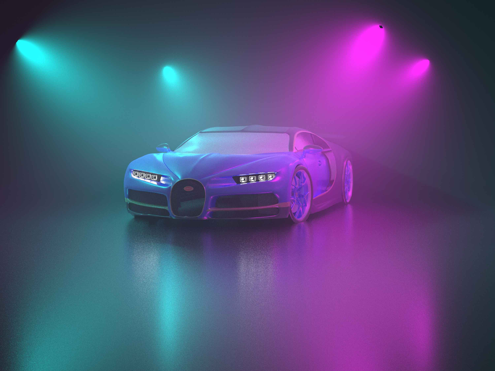

# Volumetric Path Tracing

*Yifan (York) Liu*, yil173@ucsd.edu

*Zhongyi Wang*, zhw039@ucsd.edu

## TL;DR

In this project, we learned mathematical models to represent participating media and implemented methods to render scenes with participating media and volumetric effects.

The `render` folder contains high-quality images before JPG compression.

## Math: Volume Rendering Equation

Why do we see volumetric effects such as fog and god rays in real life? There are tiny particles between objects that alters the trajectory of light. Therefore, one way to model volumetric effects physically accurately is to simulate every particles and how they reflect and refract light. This is foreseeably expensive to simulate, and thus CG scientists have developed a **mathematical model** to describe those tiny things in between objects.
$$
\begin{aligned}
L(x, \vec w) &= T_r(x_,x_z) L(x_z, \vec w) &\text{reduced background radiance}\\
&+ \int_0^z T_r(x,x_t) \sigma_s(x_t)L_s(x_t,\vec w) dt &\text{accumulated in-scattered radiance}
\end{aligned}
$$
Fear not, let us explain all these terms in detail, together with this illustration from CMU's slides.

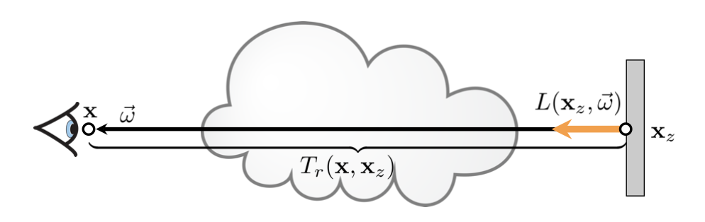

Let us assume our path tracer recursively calculates $L(x, \vec w)$: the radiance looking from point at looking at direction $\vec w$. Without the participating media in between, we would intersect this eye ray with the scene and find the closest hit point $x_z$, and calculate direct and indirect lighting $L(x_z, \vec w)$. 

Let us look at the **reduced background radiance** first. With the participating media, $L(x_z, \vec w)$ is **attenuated** (e.g. fog effect), because particles in the participating media **scatter** the light all around. $T_r(x, x_z)$ is a (0,1) factor meaning "what portion of light is left".

The second term **accumulated in-scattered radiance** is not that daunting once we realize that at every point on this light path there could be light from other directions joining into this light path. This integral is over the distance domain and at every distance $t$, it sums the in-scattered radiance $L_s(x_t, \vec w)$ at $t$, attenuated by $T_r(x, x_z)$.  There is also a scattering factor $\sigma_s(x_t)$, indicating the rate of accumulation from other light paths. This factor could be spatially varing.

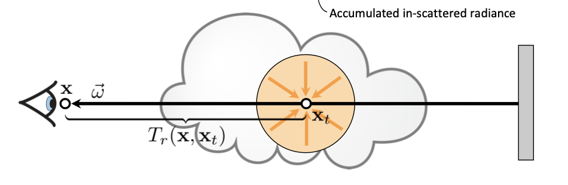

We then made several assumptions.

### Homogeneous Media

In this project, we assume there is a giant participating medium that shrouds the entire scene and this medium has the same volumetric properties at every point in space. These properties are

- $\sigma_s$: scattering factor
- $\sigma_a$: absorption factor
- $\sigma_t = \sigma_s +\sigma_a$ : extinction factor

We can simplify one more term in the rendering equation

- $T_r(x,x_t) = \exp(- \sigma_tt)$ where t is the distance between the two points

### Single Scattering

The in-scattered radiance is assumed to come from lights directly. In this sense, single scattering is similar to direct lighting.

Even with this assumption, this is still an integration over the spherical domain.
$$
\begin{aligned}
L_s(x_t, \vec w) &= \int_{S^2} phase(x_t, \vec w', \vec w) L_i(x_t, \vec w') d\vec w'\\
L_i(x_t, \vec w) &= \text{directly coming from a light, or 0 if no light }
\end{aligned}
$$
This spherical integration is similar to BRDF sampling in direct lighting, which can be substituted using next event estimation (directly enumerating all lights). We explored two methods to do this. See the next section for more details.

## Implementation Workflow

### Free-path sampling

Recall that there are two integrations in the rendering equation, the first over the distance domain, and the second over the spherical domain.

Free-path sampling **avoids both integrations**, by letting the light ray **randomly bounce off** in the middle of a participating media before hitting a surface. 

```python
tmax = distance to the closest surface
t    = sample free flight distance based on extinction coefficient
if t < tmax: # volume interaction
  # for each light: do NEE 
  # add indirect lighting based on phase function sampling
else: # surface interaction
  # just normal path tracer code.
  # NEE or BRDF sampling or both (MIS)
  # add indirect lighting
```

We first chose to implement this algorithm because the CMU slides contain very clear pseudo-code. Although we finally moved away from this algorithm, we still saved it inside the `freepath` branch in the repo.

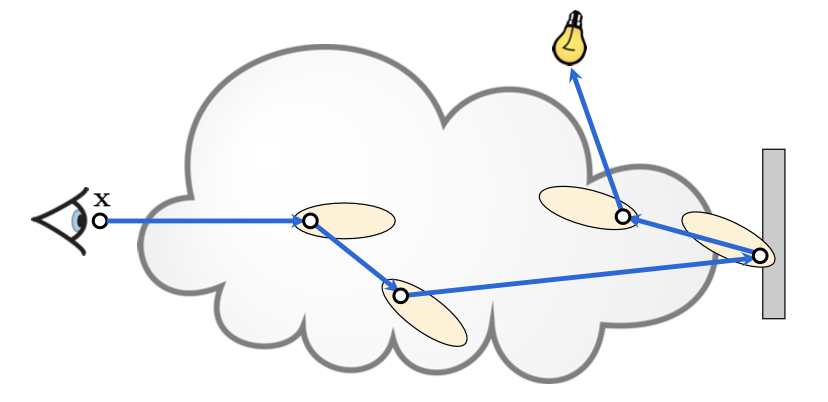 

Then we produced our first render.

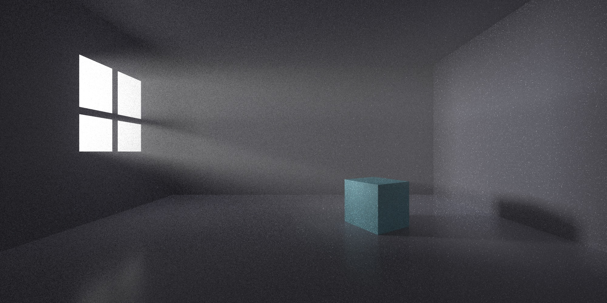

We then tried to toggle volumetric effect on/off on a classroom scene.

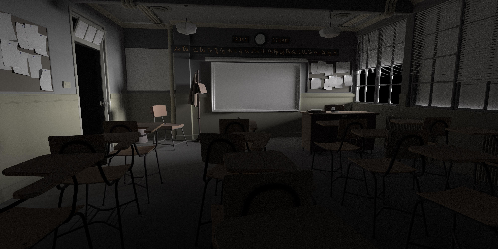

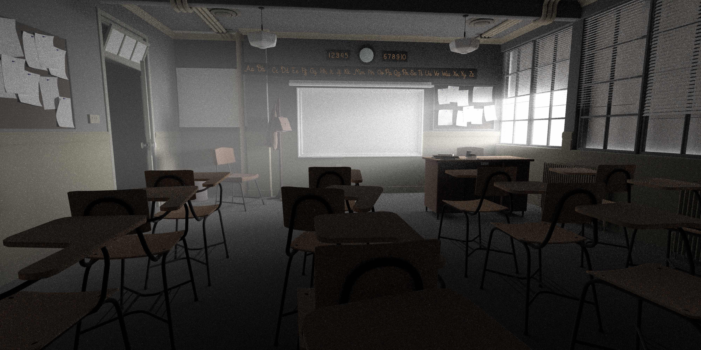

The effects are pretty cool, but we're not sure if our implementation is unbiased. There are also noticable noises. With more digging, we realized that free-path sampling is capable of rendering multiple scattering, which is not our focus at the point. It is more than what we need, so we decided to switch to another method.

### Equi-angular sampling

This method is designed for single scattering and is expected to have lower noise.

Again, recall that there are two integrations in the rendering equation, the first over the distance domain, and the second over the spherical domain.

Equi-angular sampling avoids the spherical sampling but **still samples the distance.** Recall the **accumlated in-scatterd radiance** term in the volume rendering equation. Assuming there is only one spotlight with intensity $\Phi$ at position K:
$$
\begin{aligned}
&\int_0^z T_r(x,x_t) \sigma_s(x_t)L_s(x_t,\vec w) dt\\
&= \int_0^z T_r(x,x_t) \sigma_s(x_t) \frac{\Phi}{(K-x_t)^2} dt\\
\end{aligned}
$$
It reduces noise by **importance sampling** the geometry term.

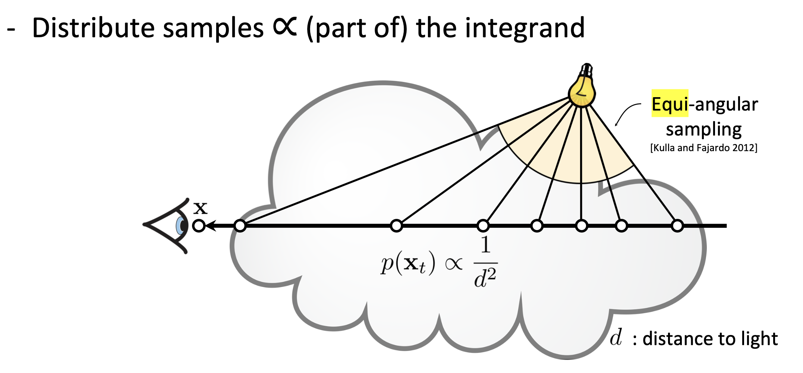

It does this by 

- finding the orthogonal projection of the light onto the eye ray,
- shifting the integration domain by a constant,
- developing a pdf proportional to the distance to light.

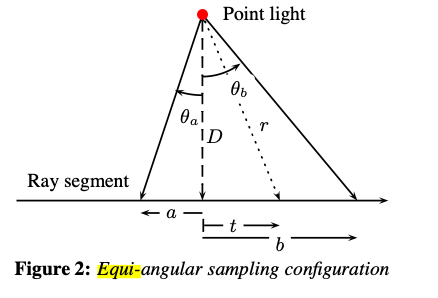
$$
\begin{aligned}
\text{accumulated in-scatterd radiance} &= \sigma_s \int_a^b T_r(x, x_t)T_r(x_t, K) Vis(x_t, K)\frac{\Phi}{D^2 +t^2} dt\\
\text{one-sample} &= \sigma_s T_r(x, x_t)T_r(x_t, K) Vis(x_t, K)\frac{\Phi}{D^2 +t^2} \bigg/ pdf(t)\\
\xi &= rand01()\\
t &= D \tan \left( (1-\xi)\theta_a + \xi \theta_b \right)\\
pdf(t) &= \frac{D}{(\theta_b - \theta_a)(D^2 + t^2)}
\end{aligned}
$$
I added a paramter `spr` (samples per ray) to indicate how many such samples should we use. During testing `spr` around 5 generally yield much better results compared to free-path sampling, with a comparable runtime. To deal with multiple lights, just add a for-loop (similar to NEE) outside of this sampling procedure.

I also implemented the **Henyey-Greenstein phase function**, with an `anisotropy` (-1 to 1) parameter added to our path tracer. The higher the anisotropy, the more light is scatter forward. 

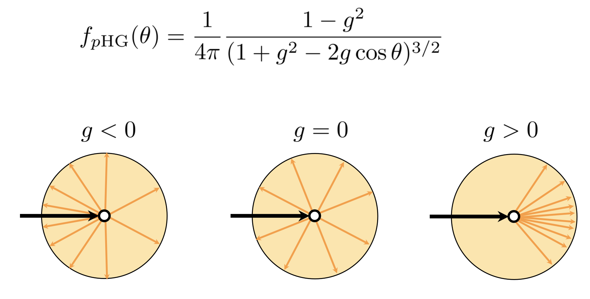

Here are some images we rendered with all the techniques in this section:

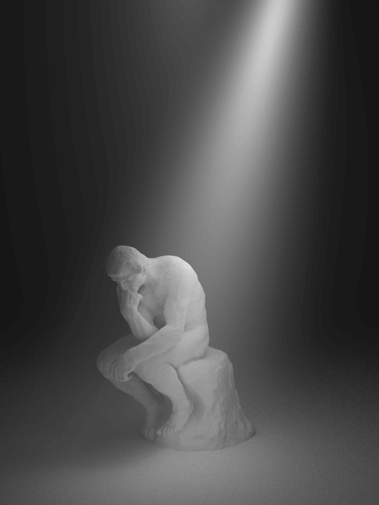

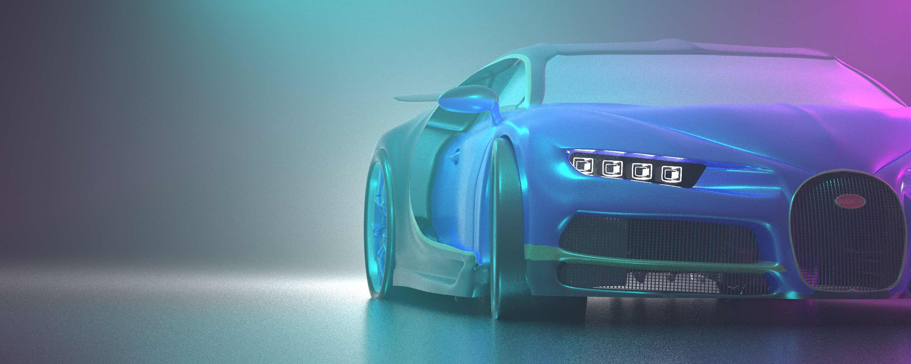


With equi-angular sampling, each image is rendered in less than 10 minutes with spp < 100 and spr = 4. (also thanks to embree3).

## Conclusion

With volumetric effects, the empty space between objects feels not empty any more.

## Appendix: more implementation details

- addtional commands in the scene file
  - volume properties (assuming one big homogeneous volume)
    - `anisotropy`: -1 to 1,  (The g parameter in the Henyey-Greenstein phase function)
    - `volumeAbsorption`: 0 to 1, $\sigma_a$
    - `volumeScattering`: 0 to 1, $\sigma_s$
  - Path tracer parameters:
    - NEE and RR always turned on
  - geometries:
    - supports only triangular meshes (no spheres)
    - `f` and `vn` similar to obj
    - Materials similar to mtl
  - Lights:
    - `quadLight2`: a spot light implementation using quad light.  `lookat, lookfrom, angle, scale, color`
- accerlation structure: embree
- compiler support: any C++20 compiler with parallel algorithms (i.e. Apple Clang not supported).

## References

- Volume rendering equation and free-path sampling: The CMU slides: http://graphics.cs.cmu.edu/courses/15-468/lectures/lecture12.pdf
- Equi-angular sampling: Importance Sampling of Area Lights in Participating Media: https://library.imageworks.com/pdfs/imageworks-library-importance-sampling-of-area-lights-in-participating-media.pdf
- Bugatt model: free3d.com
- Classroom model: blender official demos
- Thinker model: scan the world